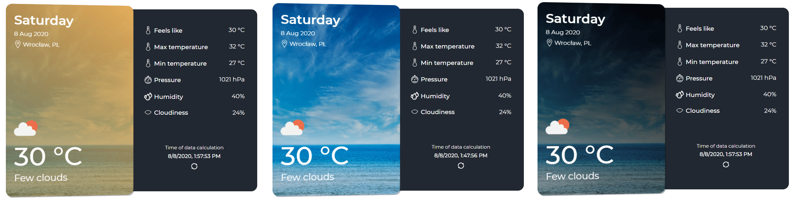

# WeatherWidgetApp
> Angular

Weather widget app enables the user to check the weather for the Wroclaw city. The data comes from OpenWeatherMap API. The app provides the following weather data :
- Current temperature,
- Maximum temperature,
- Minimum temperature,
- Feels like temperature,
- Humidity,
- Pressure,
- Cloudiness,
- Short weather description with weather icon.
  
The app refreshes itself every 5 minutes and also enable the user to refresh by himself. The background image of the app changes depending on current day time (morning, afternoon, evening).



## Website link

### [WeatherWidget]()

## Usage

```bash
npm install
ng serve --open
```